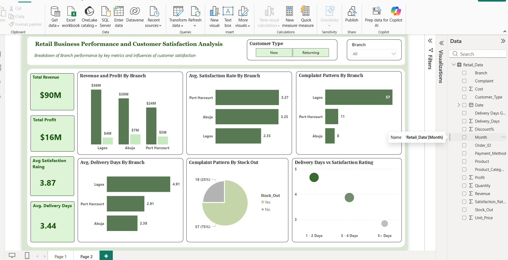
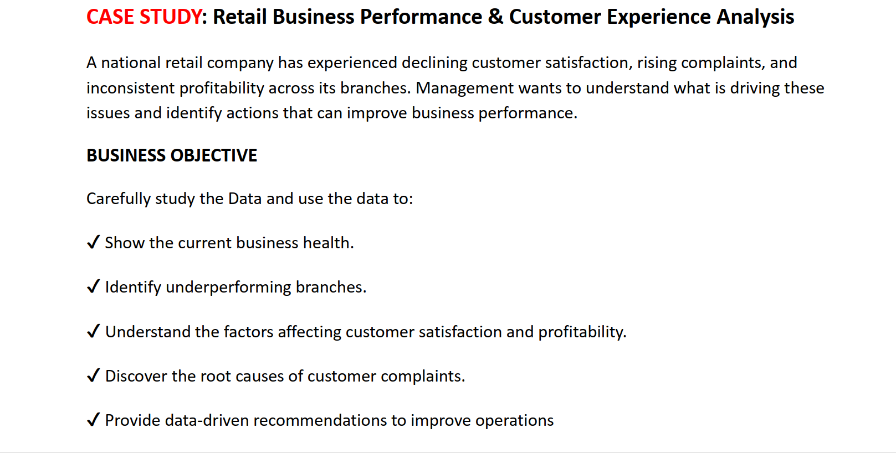
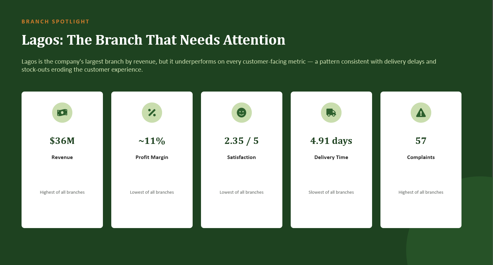
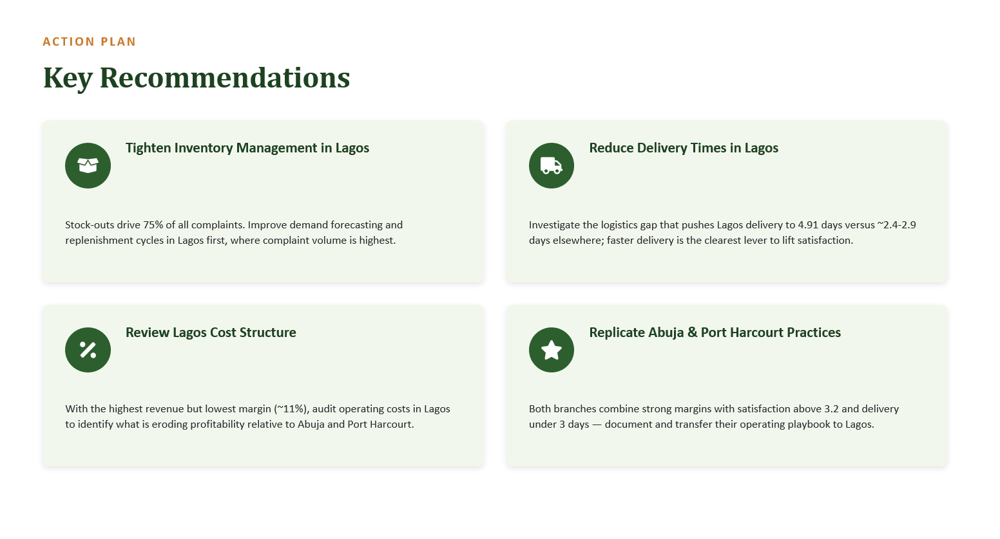

# Retail Business Performance & Customer Experience Analysis

An end-to-end Business Intelligence project that analyzes the performance of a national retail company experiencing declining customer satisfaction, rising customer complaints, and inconsistent profitability across its branches.

Using **Power BI**, **Excel**, and **DAX**, this project uncovers key business insights and provides actionable recommendations to improve operational performance and customer experience.

---

# Dashboard Preview



---

# Business Problem

A national retail company has experienced:

- Declining customer satisfaction
- Increasing customer complaints
- Inconsistent profitability across branches

Management wants to understand the root causes of these issues and identify practical strategies to improve business performance.
---

# Business Objectives

The project aims to:

- Assess the overall health of the business
- Identify high and low-performing branches
- Analyze factors affecting customer satisfaction
- Evaluate profitability across branches
- Investigate customer complaint trends
- Recommend data-driven strategies for operational improvement



---

# Tools & Technologies

- Microsoft Excel
- Power BI
- Power Query
- DAX (Data Analysis Expressions)
- Data Visualization
- Business Intelligence
- Data Storytelling

---

# Dataset

The dataset contains retail business information including:

- Branch
- Revenue
- Profit
- Customer Satisfaction Rating
- Delivery Days
- Complaint Type
- Customer Type
- Inventory Status

The original dataset is available in the **Data** folder.

---

# Dashboard Features

The dashboard includes:

- Executive KPI Cards
- Revenue Analysis
- Profit Analysis
- Customer Satisfaction Analysis
- Complaint Analysis
- Delivery Performance
- Branch Comparison
- Interactive Filters

---

# Key Performance Indicators

| KPI | Value |
|------|-------|
| Total Revenue | $90M |
| Total Profit | $16M |
| Average Satisfaction | 3.87 |
| Average Delivery Days | 3.44 |
---

# Key Insights

### Revenue & Profit

- Lagos generated the highest revenue but did not produce the highest profitability.
- Abuja achieved the strongest profitability relative to revenue.
- Port Harcourt generated the lowest revenue and profit.

### Customer Satisfaction

- Port Harcourt recorded the highest customer satisfaction.
- Lagos had the lowest customer satisfaction despite generating the highest sales.

### Customer Complaints

- Lagos accounted for the highest number of complaints.
- Approximately 75% of complaints were related to stock shortages.

### Delivery Performance

- Lagos experienced the longest average delivery time.
- Longer delivery periods were associated with lower customer satisfaction.

**Below is a picture of the Key insights, other images to suppport insights can be found in "Presentation"**



---

# Business Recommendations

Based on the analysis:

- Improve inventory management to reduce stock shortages.
- Optimize logistics to shorten delivery times.
- Review operations in the Lagos branch to improve customer experience.
- Replicate Abuja's operational strategies across other branches.
- Implement continuous customer satisfaction monitoring.



---

# Repository Structure

```
Retail-Business-Performance-Analysis
│
├── Data
│   └── Retail Business Data.xlsx
│
├── Dashboard
│   ├── Retail Business Dashboard.pbix
│   └── Dashboard.png
│
├── Presentation
│   └── Retail Business Performance Analysis.pptx
│
├── Images
│   ├── Dashboard.png
│   ├── Business_Problem.png
│   ├── Business_Objective.png
│   ├── Key_Insights.png
│   └── Recommendations.png
│
├── README.md
└── LICENSE
```

---

# Skills Demonstrated

- Data Cleaning
- Data Transformation
- Data Modeling
- DAX
- Business Intelligence
- Dashboard Development
- KPI Design
- Data Visualization
- Business Analysis
- Data Storytelling
- Business Recommendation

---

# Project Deliverables

- Excel Dataset
- Interactive Power BI Dashboard
- Business Presentation
- Executive Insights
- Strategic Recommendations

---

## Author

**Adeyinka Adebowale**

If you found this project insightful, feel free to ⭐ star the repository.
